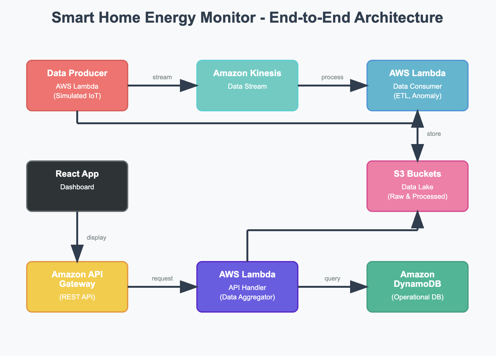
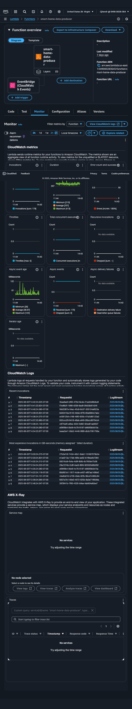
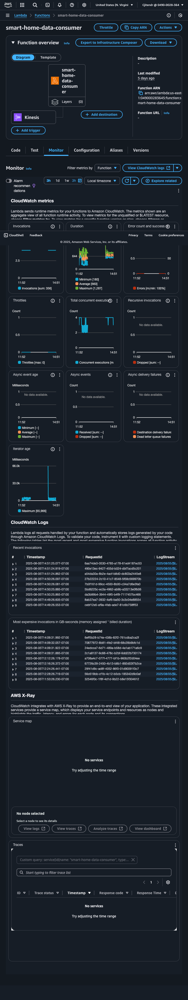
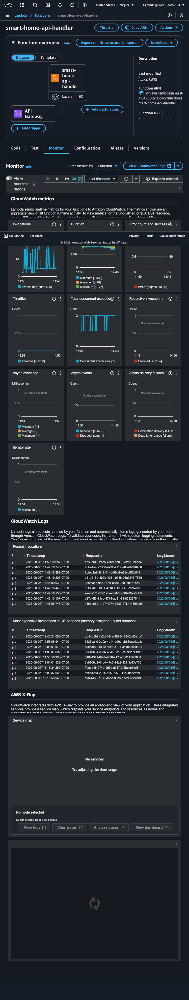

# Smart Home Energy Monitor: A Serverless Data Pipeline on AWS

## 📌 Project Summary

This project demonstrates the **end-to-end engineering of a serverless
data pipeline** for monitoring smart home energy consumption. It
simulates real-time energy usage, processes data for **anomaly
detection** and **cost estimation**, and visualizes insights on a
professional, interactive **React dashboard**.

The system leverages the **AWS Free Tier**, emphasizing a
**cost-effective, fully scalable, and serverless architecture**.

------------------------------------------------------------------------

## ✅ Key Features

-   **Real-Time Data Processing**: Simulated smart home devices push
    data to **Amazon Kinesis**, processed instantly by **AWS Lambda**.
-   **Cost & Anomaly Detection**: Real-time **energy cost calculation**
    with **rule-based anomaly detection**, and alert notifications via
    **Amazon SNS**.
-   **Multi-Layered Data Storage**:
    -   **Amazon DynamoDB** for low-latency operational queries.
    -   **Amazon S3** for raw and processed data (data lake for
        long-term analysis).
-   **Interactive React Dashboard**:
    -   Key consumption metrics
    -   Device-level breakdown
    -   Real-time trends & anomaly alerts
    -   **Smart energy-saving suggestions**
-   **Cost-Conscious Design**: Optimized to operate **within AWS Free
    Tier**.

------------------------------------------------------------------------

## 🏗️ Architecture Overview

The solution is built on an **event-driven, serverless architecture**,
demonstrating **modern data engineering principles**.


  

------------------------------------------------------------------------

## 📸 AWS Console Screenshots


------------------------------------------------------------------------



------------------------------------------------------------------------


  

------------------------------------------------------------------------

## 🛠️ Technologies Used

### **AWS Services**

-   **AWS Lambda** -- Data ingestion, ETL, anomaly detection
-   **Amazon Kinesis** -- Real-time data streaming
-   **Amazon DynamoDB** -- Operational data store
-   **Amazon S3** -- Data lake for long-term storage
-   **Amazon SNS** -- Notifications & alerts
-   **Amazon API Gateway** -- REST API integration
-   **AWS Glue & Athena** -- Data cataloging and query
-   **CloudWatch** -- Logging & monitoring

### **Frontend**

-   **React (Vite)** -- Modern web application
-   **Chart.js (react-chartjs-2)** -- Interactive visualizations
-   **HTML, CSS, JavaScript** -- Styling and logic

### **Development Tools**

-   **Node.js & npm** -- Package management
-   **Git & GitHub** -- Version control
-   **Docker** -- Containerized development

------------------------------------------------------------------------

## ⚡ Challenges & Learnings

-   **Lambda Dependencies**: Resolved `Runtime.ImportModuleError` when
    deploying large dependencies like `numpy` by using optimized
    packaging strategies.
-   **S3 Static Hosting**: Fixed **Access Denied** issue for static
    hosting by correctly configuring **bucket policy & ACLs**.
-   **Frontend Data Errors**: Prevented React `toFixed` crashes by
    adding robust **null-checks** and **fallback values**.
-   **CSS Caching Issue**: Overcame persistent UI issues by **embedding
    CSS in HTML** and enforcing **cache-busting strategies**.

------------------------------------------------------------------------

## ✅ Why This Project Matters

This project showcases **full-stack cloud engineering skills**,
including: - **Data pipeline design** - **Serverless architecture** -
**Real-time data processing** - **Cloud cost optimization** - **Frontend
integration with backend APIs**

It demonstrates my ability to **architect, troubleshoot, and deliver a
production-grade solution**.

------------------------------------------------------------------------

## 🚀 How to Run This Project

1.  **Clone the repo**

    ``` bash
    git clone <repo-url>
    cd smart-home-energy-monitor
    ```

2.  **Frontend**

    ``` bash
    cd frontend
    npm install
    npm run dev
    ```

3.  **Backend**

    -   Deploy **AWS Lambda functions** via **AWS Console** or **SAM**
    -   Set up **Kinesis stream, DynamoDB, S3 buckets** in AWS

4.  **Dashboard**

    -   Access the React app via **http://localhost:5173**

------------------------------------------------------------------------

## 📌 Future Enhancements

-   AI-based **predictive energy optimization**
-   Voice assistant integration (Alexa, Google Home)
-   Integration with **IoT Core** for real device data

------------------------------------------------------------------------

### 👤 Author

**Chetan Jitendra**\
Data Science & Cloud Enthusiast \| [LinkedIn](#) \| [GitHub](#)

------------------------------------------------------------------------
